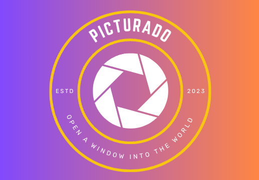
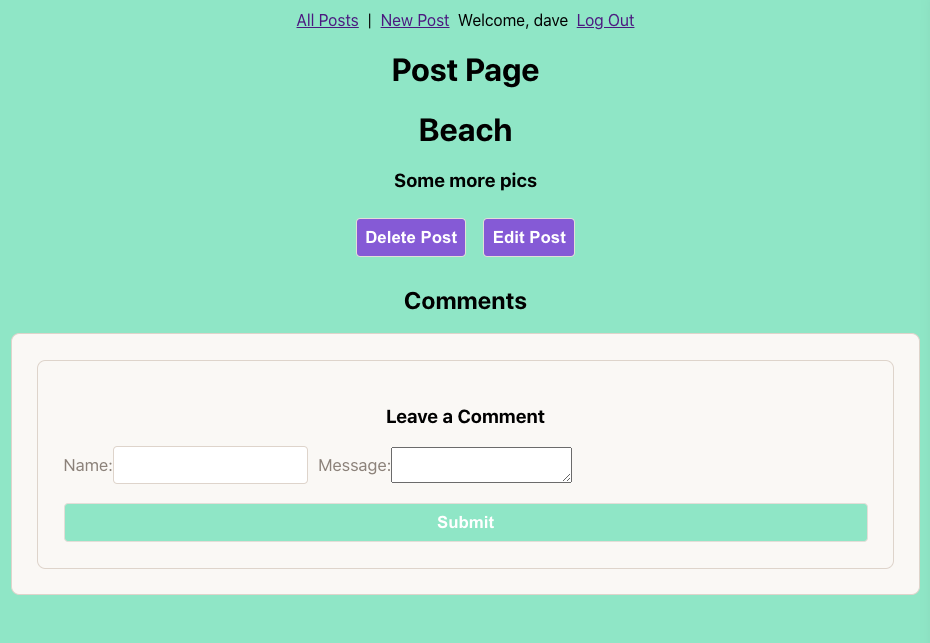

Picturado

Technologies:
React-Express-NodeJs-MongoDB-Mongoose-CSS

This project was designed to be an image sharing site, which allowed for in app  real-time messaging, following, liking, and commenting. Curent state allows for creation of posts and comments, as well as editing and updating. I will be implementing image sharing soon, as well as a timeline page for posts from people you follow.

Upcomming changes:
-Material UI design
-Image sharing functinality
-Following / liking
-Timeline feature

Long-term:
-AI powered search
-Live in-app chat (DM's)

https://picturado.herokuapp.com/